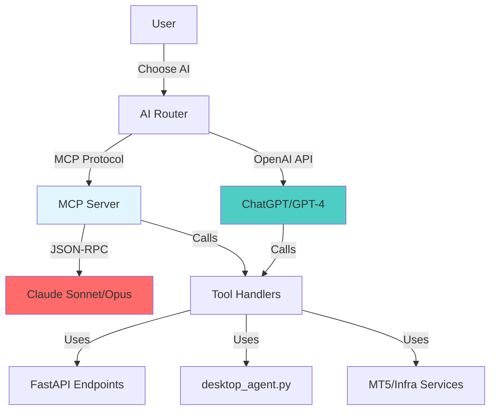

# MCP Server Implementation Plan for Claude Integration

## Overview

This plan implements a Model Context Protocol (MCP) server that exposes your trading system's tools to Claude, enabling dual AI support (ChatGPT + Claude) for trade analysis and recommendations.

## Architecture



## Phase 1: MCP Server Foundation

### 1.1 Create MCP Server Module

**File**: `infra/mcp_server.py` (NEW)

**Purpose**: Core MCP server implementation using JSON-RPC over stdio/HTTP

**Key Components**:

- MCP server class implementing JSON-RPC 2.0 protocol
- Tool registration system (maps MCP tools to existing tool functions)
- Request/response handling
- Error handling and logging

**Dependencies**:

- `mcp` Python SDK (if available) or custom JSON-RPC implementation
- Existing tool functions from `desktop_agent.py`

### 1.2 Tool Mapping System

**File**: `infra/mcp_tool_mapper.py` (NEW)

**Purpose**: Maps MCP tool definitions to existing tool functions

**Key Functions**:

- `register_tool(name, handler, schema)` - Register tool with MCP schema
- `call_tool(name, arguments)` - Execute tool and return result
- `list_tools()` - Return all available tools with schemas

**Tool Categories to Map**:

1. **Market Analysis Tools**:

   - `analyse_symbol_full` → `tool_analyse_symbol_full`
   - `get_current_price` → `tool_get_current_price`
   - `macro_context` → `tool_macro_context`
   - `btc_order_flow_metrics` → `tool_btc_order_flow_metrics`

2. **Trading Tools**:

   - `execute_trade` → `tool_execute_trade`
   - `execute_bracket_trade` → `tool_execute_bracket_trade`
   - `get_positions` → `tool_get_positions`
   - `modify_position` → `tool_modify_position`

3. **Auto-Execution Tools**:

   - `create_auto_trade_plan` → `tool_create_auto_trade_plan`
   - `get_auto_plan_status` → `tool_get_auto_plan_status`
   - `cancel_auto_plan` → `tool_cancel_auto_plan`

4. **Analysis Tools**:

   - `get_m1_microstructure` → `tool_get_m1_microstructure`
   - `lot_sizing_info` → `tool_lot_sizing_info`

## Phase 2: MCP Tool Schema Generation

### 2.1 Convert OpenAI Schema to MCP Schema

**File**: `infra/mcp_schema_converter.py` (NEW)

**Purpose**: Convert `openai.yaml` tool definitions to MCP tool schemas

**Key Functions**:

- `convert_openapi_to_mcp(openapi_spec)` - Parse OpenAPI 3.1.0 and convert to MCP format
- `generate_mcp_tool_schema(tool_name, openapi_operation)` - Generate MCP schema for single tool
- `validate_mcp_schema(schema)` - Validate generated schema

**Schema Format**:

```python
{
    "name": "analyse_symbol_full",
    "description": "Comprehensive market analysis...",
    "inputSchema": {
        "type": "object",
        "properties": {
            "symbol": {
                "type": "string",
                "description": "Trading symbol (e.g., XAUUSDc)"
            }
        },
        "required": ["symbol"]
    }
}
```

### 2.2 Tool Schema Registry

**File**: `infra/mcp_tool_registry.py` (NEW)

**Purpose**: Central registry of all MCP tools with schemas

**Key Features**:

- Load schemas from `openai.yaml` on startup
- Cache converted schemas
- Provide schema lookup by tool name
- Support dynamic tool registration

## Phase 3: MCP Server Transport

### 3.1 Stdio Transport (Primary)

**File**: `infra/mcp_stdio_server.py` (NEW)

**Purpose**: MCP server using stdio transport (standard for Claude Desktop)

**Implementation**:

- Read JSON-RPC requests from stdin
- Write JSON-RPC responses to stdout
- Handle connection lifecycle
- Support graceful shutdown

**Usage**: Claude Desktop connects via stdio by default

### 3.2 HTTP Transport (Optional)

**File**: `infra/mcp_http_server.py` (NEW)

**Purpose**: MCP server using HTTP transport (for web-based Claude)

**Implementation**:

- FastAPI endpoint for MCP requests
- JSON-RPC over HTTP POST
- CORS support for web clients
- Authentication (API key or token)

**Endpoint**: `POST /mcp/request`

## Phase 4: AI Router System

### 4.1 AI Router Module

**File**: `infra/ai_router.py` (NEW)

**Purpose**: Route requests to ChatGPT or Claude based on user preference

**Key Features**:

- User preference storage (config file or database)
- Request routing logic
- Response formatting (normalize both AI responses)
- Fallback handling (if one AI unavailable)

**Configuration**:

```python
{
    "default_ai": "chatgpt",  # or "claude"
    "per_user_preferences": {
        "user_id": "claude"
    },
    "feature_routing": {
        "complex_analysis": "claude",
        "quick_queries": "chatgpt"
    }
}
```

### 4.2 Integration Points

**Files to Modify**:

- `desktop_agent.py` - Add AI router check before tool execution
- `handlers/chatgpt_bridge.py` - Add Claude option
- `app/main_api.py` - Add MCP endpoint (if using HTTP transport)

## Phase 5: Claude Knowledge Documents

### 5.1 Convert ChatGPT Knowledge to Claude Format

**File**: `docs/Claude Knowledge Documents/` (NEW DIRECTORY)

**Purpose**: Claude-specific knowledge documents (similar to ChatGPT knowledge docs)

**Key Documents**:

- `CLAUDE_TRADING_SYSTEM_GUIDE.md` - System overview
- `CLAUDE_AUTO_EXECUTION_GUIDE.md` - Auto-execution instructions
- `CLAUDE_MARKET_ANALYSIS_GUIDE.md` - Market analysis guidelines
- `CLAUDE_TOOL_USAGE_GUIDE.md` - Tool usage instructions

**Differences from ChatGPT Docs**:

- Claude-specific formatting
- Emphasis on reasoning and validation
- Mandatory field checklists (Claude is better at following these)
- Risk assessment guidelines

### 5.2 System Prompt for Claude

**File**: `infra/claude_system_prompt.py` (NEW)

**Purpose**: System prompt that Claude receives on connection

**Key Sections**:

- Trading system overview
- Tool usage guidelines
- Mandatory field requirements
- Risk management rules
- Response formatting requirements

## Phase 6: Configuration and Setup

### 6.1 MCP Server Configuration

**File**: `config/mcp_config.py` (NEW)

**Purpose**: MCP server configuration

**Settings**:

- Transport type (stdio/HTTP)
- Server port (if HTTP)
- Tool timeout settings
- Logging configuration
- Authentication settings

### 6.2 Claude Desktop Configuration

**File**: `claude_desktop_config.json` (NEW)

**Purpose**: Configuration file for Claude Desktop to connect to MCP server

**Location**: Claude Desktop config directory (OS-specific)

**Format**:

```json
{
    "mcpServers": {
        "moneybot-trading": {
            "command": "python",
            "args": ["-m", "infra.mcp_stdio_server"],
            "cwd": "C:\\Coding\\MoneyBotv2.7 - 10 Nov 25"
        }
    }
}
```

## Phase 7: Testing and Validation

### 7.1 Unit Tests

**File**: `tests/test_mcp_server.py` (NEW)

**Test Cases**:

- Tool registration
- Schema conversion
- Request/response handling
- Error handling
- Tool execution

### 7.2 Integration Tests

**File**: `tests/test_mcp_integration.py` (NEW)

**Test Cases**:

- End-to-end tool calls
- Claude connection
- AI router functionality
- Response formatting

### 7.3 Manual Testing Guide

**File**: `docs/MCP_MANUAL_TESTING.md` (NEW)

**Test Scenarios**:

1. Connect Claude Desktop to MCP server
2. Request market analysis via Claude
3. Compare Claude vs ChatGPT responses
4. Test tool execution (non-destructive)
5. Verify AI router switching

## Phase 8: Documentation

### 8.1 MCP Setup Guide

**File**: `docs/MCP_SETUP_GUIDE.md` (NEW)

**Contents**:

- Installation instructions
- Claude Desktop configuration
- Tool usage examples
- Troubleshooting

### 8.2 AI Selection Guide

**File**: `docs/AI_SELECTION_GUIDE.md` (NEW)

**Contents**:

- When to use ChatGPT
- When to use Claude
- Feature comparison
- Performance considerations

## Implementation Order

1. **Phase 1**: MCP Server Foundation (Core infrastructure)
2. **Phase 2**: Schema Conversion (Tool definitions)
3. **Phase 3**: Transport Layer (Connection methods)
4. **Phase 4**: AI Router (Dual AI support)
5. **Phase 5**: Knowledge Documents (Claude instructions)
6. **Phase 6**: Configuration (Setup files)
7. **Phase 7**: Testing (Validation)
8. **Phase 8**: Documentation (User guides)

## Key Files to Create

1. `infra/mcp_server.py` - Core MCP server
2. `infra/mcp_tool_mapper.py` - Tool mapping
3. `infra/mcp_schema_converter.py` - Schema conversion
4. `infra/mcp_tool_registry.py` - Tool registry
5. `infra/mcp_stdio_server.py` - Stdio transport
6. `infra/mcp_http_server.py` - HTTP transport (optional)
7. `infra/ai_router.py` - AI routing logic
8. `infra/claude_system_prompt.py` - Claude system prompt
9. `config/mcp_config.py` - MCP configuration
10. `claude_desktop_config.json` - Claude Desktop config
11. `docs/Claude Knowledge Documents/` - Claude knowledge docs
12. `tests/test_mcp_server.py` - Unit tests
13. `tests/test_mcp_integration.py` - Integration tests
14. `docs/MCP_SETUP_GUIDE.md` - Setup documentation
15. `docs/AI_SELECTION_GUIDE.md` - AI selection guide

## Key Files to Modify

1. `desktop_agent.py` - Add AI router integration
2. `handlers/chatgpt_bridge.py` - Add Claude option
3. `app/main_api.py` - Add MCP HTTP endpoint (optional)
4. `config/settings.py` - Add MCP configuration options

## Dependencies

**New Python Packages**:

- `mcp` (Anthropic MCP SDK) - If available
- Or custom JSON-RPC implementation using `jsonrpc` library

**Existing Dependencies** (already in use):

- `fastapi` - For HTTP transport (optional)
- `asyncio` - For async operations
- All existing trading system dependencies

## Success Criteria

1. Claude can connect to MCP server via stdio
2. Claude can call all major trading tools
3. AI router allows switching between ChatGPT and Claude
4. Both AIs produce comparable results
5. System maintains backward compatibility with ChatGPT
6. Documentation is complete and tested

## Risks and Mitigations

**Risk 1**: MCP SDK not available or incomplete

- **Mitigation**: Implement custom JSON-RPC handler

**Risk 2**: Claude Desktop configuration complexity

- **Mitigation**: Provide detailed setup guide with examples

**Risk 3**: Tool schema conversion issues

- **Mitigation**: Comprehensive testing of schema conversion

**Risk 4**: Performance impact of dual AI support

- **Mitigation**: Lazy loading, caching, efficient routing

## Future Enhancements

1. **AI Comparison Mode**: Run both AIs and compare results
2. **AI Ensemble**: Combine ChatGPT and Claude recommendations
3. **Performance Analytics**: Track which AI performs better for different tasks
4. **Custom AI Selection Rules**: Automatic AI selection based on query type
5. **Web Interface**: Web-based Claude integration (using HTTP transport)

