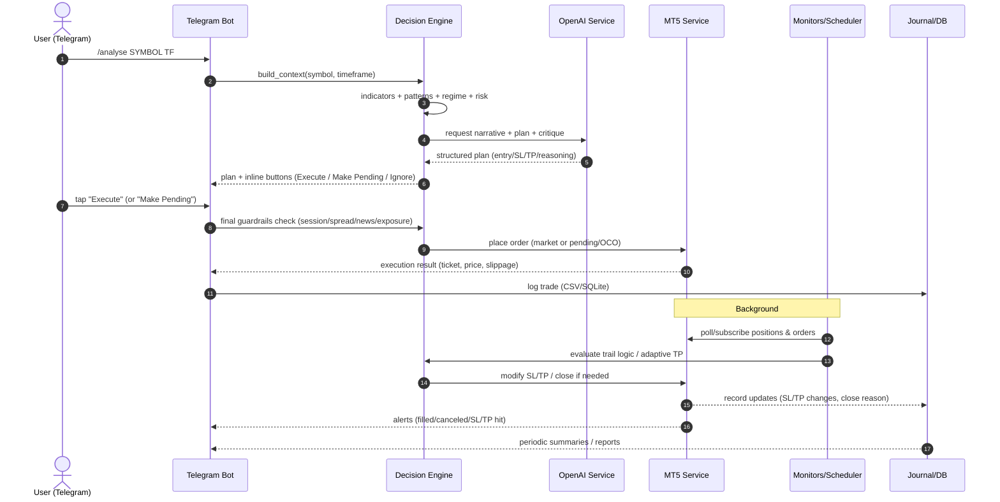
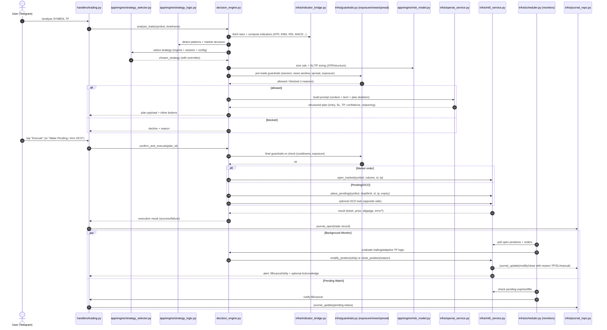

# TelegramMoneyBot.v8 — End-to-End Lifecycle
**Flow:** `/analyse → plan → approve → MT5 execute → monitor → trail/close → journal`

Below are two Mermaid sequence diagrams:
1) **High-Level** user journey.
2) **Detailed** module-level interactions specific to your v8 architecture (handlers, infra, engine, guards, MT5, monitors, journal).

---

## 1) High-Level Sequence

---

## 2) Detailed Module-Level Sequence

---

### Notes
- **Guardrails**: combine session windows, news blackouts, spread thresholds, exposure caps, and cooldowns.
- **Risk Model**: converts confidence/context → position size and RR, aligns SL/TP with ATR and structure.
- **Strategy Selector/Logic**: switches filters and overrides per strategy & market regime.
- **Indicator Bridge**: prefers native MT5 handles; falls back to pandas/numpy when needed.
- **Journal Repo**: writes to CSV/SQLite and supports summaries (daily/weekly).

